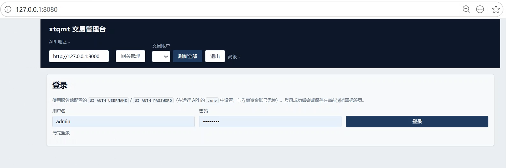
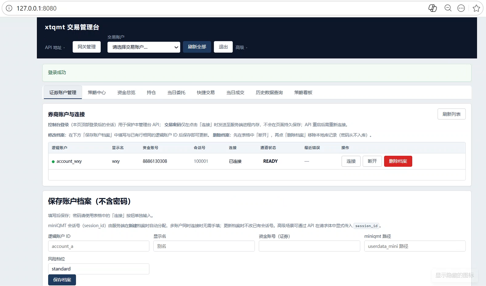
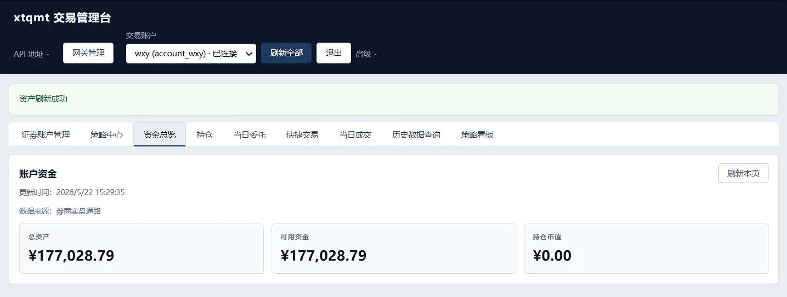
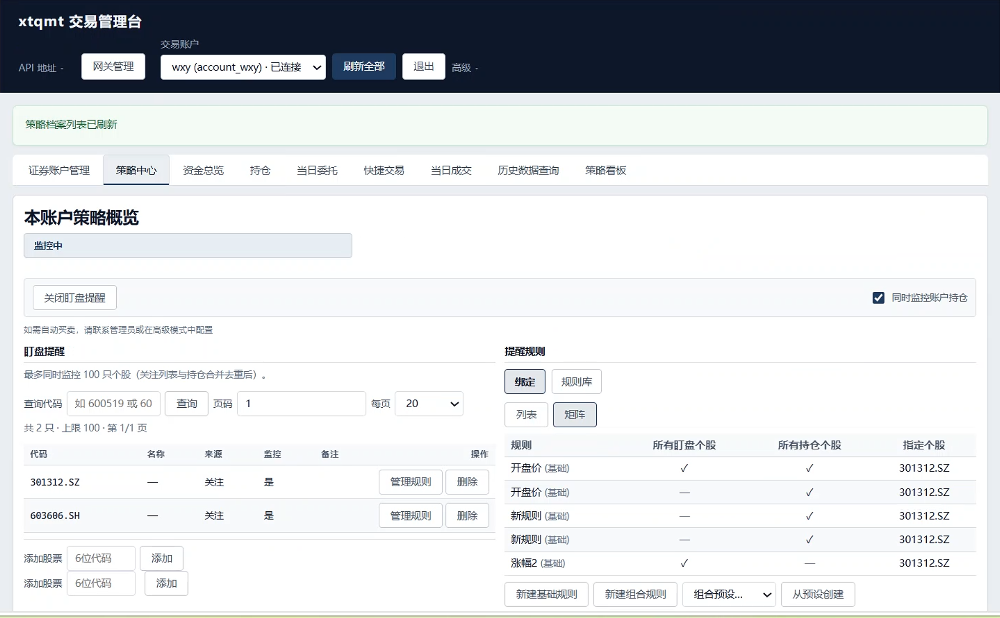
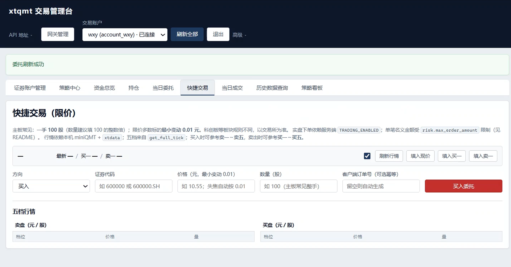
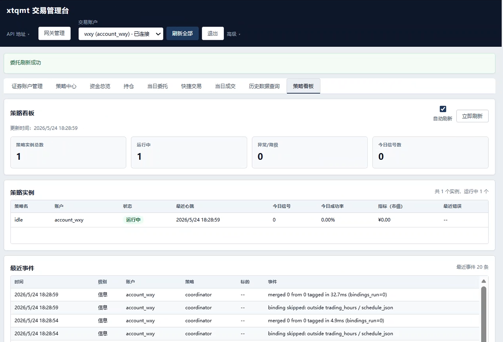

# openclaw-miniqmt-bridge · v0.1.3

面向 **miniQMT / xtquant** 的实盘执行与运营中间件：策略只负责「想什么」，下单编排、风控、对账与可观测由中间层完成。

**Agent 接入**：安装并启动 **MCP 服务**（`Run-MCP.cmd`）后，**OpenClaw**、**Hermes-Agent** 及 Cursor 等 MCP 客户端可**直接调用**本系统——查询**账户资金/资产**、**持仓**，以及受控的**限价下单、撤单**（须 `TRADING_ENABLED=true` 且账户已在管理台 **connect**）。

**边界**：本软件不提供投资建议、不承诺收益、不替代券商交易终端与交易所规则。

---

## 这是什么

本系统把 **策略决策** 与 **实盘执行** 分层：策略侧产出 **`OrderIntent` / `TargetPosition`**，中间层负责 OMS、幂等、事前风控、事件驱动状态机与本地账本。适合个人或小团队量化开发者，以及需要在 **Windows 单机** 上稳定交付、复盘与扩展的场景。

除管理台与 REST API 外，本桥还是 **OpenClaw / Hermes-Agent 的实盘执行后端**：Agent 通过 MCP 工具链读写同一套账户与订单状态，无需在 Agent 侧集成 miniQMT SDK。

---

## 核心能力

### Runtime

- 常驻策略循环、对账与健康检查
- 周期快照写入本地 **SQLite**（资金、当日委托/成交、跨日历史）
- 支持「仅同步库」模式（`Run-Runtime-sync.cmd`），不要求活动策略配置

### HTTP API + 管理台

- 资金、持仓、当日委托/成交、历史查询与 CSV 导出
- 证券账户档案、策略配置、策略看板
- 网关 MCP 管理（`http://127.0.0.1:8080/admin/`）
- 券商口令经 API **内存连接**，**不入库**

### 策略中心

- 盯盘提醒：关注列表、规则库、规则绑定矩阵
- 简易模式维护盯盘规则，无需手写 YAML
- 策略实例状态与最近事件可在「策略看板」查看

### OpenClaw / Hermes-Agent 接入

本系统内置 **MCP 服务**（安装根 **`Run-MCP.cmd`**），将 HTTP API 封装为标准 MCP 工具，供 **OpenClaw**、**Hermes-Agent**、Cursor 等客户端**直接调用**：

| 能力 | 说明 |
|------|------|
| **查询账户资产** | 资金余额、可用资金、总资产等（如 `get_account_assets`） |
| **查询持仓** | 当前持仓列表与数量（如 `get_positions`） |
| **查询委托/成交** | 当日与历史委托、成交、权益曲线等 |
| **直接下单** | 限价买卖、批量下单、撤单（如 `place_limit_order`、`place_limit_order_batch`） |
| **行情辅助** | 实时行情、代码联想等 |

**典型联调顺序**：`Run-API.cmd` → 管理台 **connect** 账户 → `Run-MCP.cmd` → 在 OpenClaw / Hermes-Agent 中配置 MCP 地址与 `MCP_API_TOKEN`（与 `API_TOKEN` 一致）。

**安全约束**：写操作受 **`TRADING_ENABLED`**、**`API_TOKEN`** 与事前风控（如单笔金额上限）约束；联调建议先设 `TRADING_ENABLED=false` 验证查询与拒单路径。Hermes 交易技能包（信号交易、买卖单、持仓查询等）见 [`hermes-agent/skills/trade/`](hermes-agent/skills/trade/)；工具清单与配置见 [`hermes-agent/skills/trade/references/mcp_runbook.md`](hermes-agent/skills/trade/references/mcp_runbook.md)。

---

## 管理台预览

按典型使用顺序：

### 1. 登录

使用服务端 `.env` 中的 `UI_AUTH_USERNAME` / `UI_AUTH_PASSWORD`（与券商资金账号无关）。



### 2. 证券账户管理

保存账户档案（不含密码），连接时输入券商口令；口令仅存 API 进程内存。



### 3. 资金总览

查看总资产、可用资金、持仓市值及数据来源。



### 4. 策略中心

配置盯盘关注列表与提醒规则；可绑定到全部关注股、持仓或指定标的。



### 5. 当日委托

查看当日委托列表与状态。



### 6. 策略看板

策略实例总数、运行状态、今日信号与最近事件。



---

## 下载与安装

**当前推荐形态：Windows + GitHub Releases**（wheelhouse zip，需本机 **Python 3.10+**）。

| 项 | 说明 |
|----|------|
| Release 页 | [openclaw-miniqmt-bridge](https://github.com/yorkqqcom/openclaw-miniqmt-bridge/releases/tag/openclaw-miniqmt-bridge) |
| 下载基址 | `https://github.com/yorkqqcom/openclaw-miniqmt-bridge/releases/download/openclaw-miniqmt-bridge/` |
| 主要资产 | `openclaw-miniqmt-bridge-0.1.3-wheels.zip`、`install.ps1`、`SHA256SUMS`；可选 `remote_install_bootstrap.ps1` |

**前置条件**：Windows 10/11（x64）、Python 3.10+ 在 PATH 中、已安装并启动 **MiniQMT / QMT** 终端。

### 方式 A — 推荐（安全主路径）

1. 从 Release 下载 `install.ps1`、`openclaw-miniqmt-bridge-0.1.3-wheels.zip`、`SHA256SUMS`。
2. 校验 zip 的 SHA-256（与 `SHA256SUMS` 中对应行一致）：

   ```powershell
   Get-FileHash -Algorithm SHA256 .\openclaw-miniqmt-bridge-0.1.3-wheels.zip
   ```

3. 在同一目录执行（将 `ExpectedSha256` 换成 `SHA256SUMS` 中的 64 位小写 hex）：

   ```powershell
   powershell -NoProfile -ExecutionPolicy Bypass -File .\install.ps1 `
     -DownloadBaseUrl "https://github.com/yorkqqcom/openclaw-miniqmt-bridge/releases/download/openclaw-miniqmt-bridge/" `
     -BundleFileName "openclaw-miniqmt-bridge-0.1.3-wheels.zip" `
     -ExpectedSha256 "4a8f4ce858cbee19086cca69e18adaab0fcdf5b49833095fd90c7b7c310cb1d4"
   ```

默认在安装目录创建 `openclaw-install`（或事先设置 `$env:OPENCLAW_INSTALL_ROOT` 指定路径）。更多参数见 [docs/install_curl.md](docs/install_curl.md)。

### 方式 B — 一行 bootstrap（弱于 A）

等价于从 GitHub 拉取远程脚本并执行，仅校验 zip、不校验 `install.ps1` 本体；需信任 HTTPS 与 Release 资产。

```powershell
$u='https://github.com/yorkqqcom/openclaw-miniqmt-bridge/releases/download/openclaw-miniqmt-bridge/remote_install_bootstrap.ps1'; $r=Invoke-WebRequest -Uri $u -UseBasicParsing; iex ($(if ($r.Content -is [byte[]]) { [System.Text.Encoding]::UTF8.GetString($r.Content) } else { [string]$r.Content }))
```

可选：仅 API + 管理台、不生成 `Run-Runtime.cmd` 时，先设置 `$env:OPENCLAW_SKIP_RUNTIME='1'` 再执行上一行。

---

## 安装后快速上手

安装完成后，进入安装根目录（默认 `openclaw-install`），按以下顺序操作：

1. **配置环境**：复制 `.env.example` → `.env`，至少设置 `APP_DB_URL`（建议文件库，如 `data/runtime.db`）、`API_TOKEN`、**`TRADING_ENABLED=false`**（联调期建议关闭实盘下单）。
2. **启动券商终端**：先打开本机 MiniQMT / QMT。
3. **启动服务**（各开一个 PowerShell 窗口）：
   - 窗口 1：`.\Run-API.cmd`（默认 `http://127.0.0.1:8000`）
   - 窗口 2：`.\Run-UI.cmd`（默认 `http://127.0.0.1:8080`）
4. **管理台**：登录 →「证券账户管理」保存档案 → **连接** 目标账户。
5. **（可选）Agent 接入**：`.\Run-MCP.cmd`，在 OpenClaw / Hermes-Agent 中指向 MCP 服务；即可**查询资产与持仓**、在 `TRADING_ENABLED=true` 时**直接下单**。
6. **确认无误后**：将 `.env` 中 `TRADING_ENABLED` 改为 `true` 方可实盘下单；网卡许可见 `.env.example` 与 `NIC_LICENSE_REQUIRED`（开发联调可设 `NIC_LICENSE_REQUIRED=false`）。

### 安装根启动器

| 启动器 | 用途 |
|--------|------|
| `Run-API.cmd` | HTTP API（须最先启动） |
| `Run-UI.cmd` | 管理台静态站 |
| `Run-MCP.cmd` | MCP 服务（须在 API 就绪且账户已 connect 后启动） |
| `Run-Runtime.cmd` | 完整策略循环（`--mode live --env prod`） |
| `Run-Runtime-sync.cmd` | 仅同步本地库（对账/快照，不要求活动策略） |

更完整的启动路径与排障见 [docs/release_packaging_flow.md](docs/release_packaging_flow.md) §零点三、[release-readme.md](release-readme.md)。

---

## 产品边界

- 软件为**交易执行与信息管理工具**；证券交易风险由用户自行承担。
- **不做收益承诺**，不在产品内替你写策略逻辑或荐股。
- 券商交易密码仅通过管理台「连接」或 API 传入进程内存，**不写入 Git、不入库**；重启 API 后需重新连接。
- 问题反馈请在本仓库 [Issues](https://github.com/yorkqqcom/openclaw-miniqmt-bridge/issues) 提交，并附上版本号、复现步骤与脱敏后的日志。

---

## 延伸阅读

- [release-readme.md](release-readme.md) — 发布包详细说明
- [docs/install_curl.md](docs/install_curl.md) — 安装参数与安全说明
- [hermes-agent/skills/trade/references/mcp_runbook.md](hermes-agent/skills/trade/references/mcp_runbook.md) — MCP 工具与 OpenClaw / Hermes-Agent 联调
- [hermes-agent/skills/trade/](hermes-agent/skills/trade/) — Hermes 交易技能包（查询、下单、信号交易等）
- [docs/marketing_positioning.md](docs/marketing_positioning.md) — 对外定位与宣传边界
